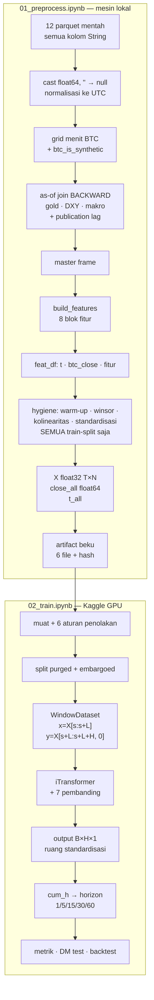

# Target Prediksi dan Alur Data — Penjelasan Teori

Dokumen ini menjawab satu pertanyaan: **apa sebenarnya yang diprediksi model ini?** Lalu
menelusuri alur dari file parquet mentah sampai angka yang dilaporkan.

Semua klaim di bawah diverifikasi dari kode notebook, bukan dari ingatan. Nomor sel merujuk
`notebooks/iTransformer.ipynb`, yang menjadi sumber `01_preprocess.ipynb` dan `02_train.ipynb`.

---

## 1. Jawaban singkat

**Bukan.** Target **bukan** `close_btc`.

Target adalah **`btc_logret_1`** — *log return* 1 menit dari harga close BTC:

```
r_i = log(close_i) − log(close_{i−1})
```

Di kode (sel 29): `_lc = log(btc_close)`, lalu `btc_logret_1 = _lc.diff()`.

Empat fakta struktural yang mengikatnya:

| Fakta | Di mana | Kenapa penting |
| --- | --- | --- |
| `TARGET_NAME = "btc_logret_1"` | sel 32 | satu-satunya definisi target |
| `assert FEATURE_NAMES_RAW[0] == "btc_logret_1"` | sel 30 | target **wajib** variat ke-0 |
| `assert TARGET_IDX == 0` setelah pruning | sel 32 | pruning kolinearitas tidak boleh menggeser target |
| `feature_order[target_index] == "btc_logret_1"` | aturan penolakan #5 | artifact yang tertukar urutan ditolak |

Empat lapis pemeriksaan untuk satu fakta — karena matriks dengan urutan variat tertukar
**tidak menghasilkan error**, ia menghasilkan angka yang tampak wajar. Itu mode kegagalan
terburuk di proyek ini.

---

## 2. Kenapa bukan level harga

Harga BTC 1 menit adalah proses yang praktis **unit-root** (random walk). Model yang
memprediksi *level* bisa mencapai R² ≈ 0,999 hanya dengan menggemakan `close_t` — dan
membawa **nol** informasi.

| Pendekatan | R² tipikal | Informasi |
| --- | --- | --- |
| Prediksi `close_{t+h}` | ~0,999 | nol — ini hanya `close_t` yang disalin |
| Prediksi `r_t^{(h)}` | ~0,00–0,05 | inilah yang sesungguhnya sulit |

Karena itu **setiap MSE pada level harga tidak bermakna** di proyek ini. CLAUDE.md §7.1
menyatakannya sebagai aturan, dan §13.2 menuntut MASE relatif terhadap naive — karena MSE
mentah pada return pun sulit dibaca tanpa pembanding.

Konsekuensi lain yang sering terlewat: **baseline naive di sini sangat kuat.** Untuk return,
naive berarti `ŷ = 0`. Mengalahkan "selalu tebak nol" pada frekuensi 1 menit itu sulit, dan
`MASE ≥ 1` berarti model tidak berguna.

---

## 3. Definisi target yang tepat

### 3.1 Yang dikeluarkan model

Model mengeluarkan **`H` return satu-menit berurutan**, bukan satu angka:

```
output : (B, H, 1)   ->  [r̂_{t+1}, r̂_{t+2}, ..., r̂_{t+H}]
```

dengan `H = pred_len` (default 60). Titik asal ramalan `t` adalah **baris input terakhir**.

### 3.2 Horizon kumulatif diturunkan, bukan dilatih terpisah

`CFG.horizons = (1, 5, 15, 30, 60)` **tidak** berarti lima model. Kelimanya diturunkan dari
satu keluaran dengan penjumlahan awalan (sel 52):

```python
def cum_h(a, h):
    return a[:, :h].sum(axis=1)
```

Ini sah karena identitas teleskopik. Label pada baris `t+1 … t+h` adalah return satu-menit,
jadi:

```
Σ_{k=1..h} r_{t+k}  =  Σ_{k=1..h} [log(close_{t+k}) − log(close_{t+k−1})]
                    =  log(close_{t+h}) − log(close_t)
                    =  y_t^{(h)}
```

Jadi definisi CLAUDE.md §7.1 (`y_t^{(h)} = log(close_{t+h}) − log(close_t)`) dan implementasi
H-langkah adalah **objek yang sama persis**, bukan aproksimasi. Log return bersifat aditif;
return sederhana tidak — itu salah satu alasan memakai log.

### 3.3 Target adalah kolom dari `X`, bukan array terpisah

Ini keputusan arsitektural yang menjelaskan banyak hal lain. Tidak ada `y.npy`. Label
**disayat dari matriks fitur itu sendiri** (sel 36):

```python
# sample pada start s:
x = X[s : s+L]                      # (L, N)  seluruh variat, masa lalu
y = X[s+L : s+L+H, target_idx]      # (H,)    hanya variat target, masa depan
```

Tiga akibat langsung:

1. **Target ikut menjadi input.** Return masa lalu adalah fitur; return masa depan adalah label.
   Keduanya kolom yang sama, jendela waktu yang berbeda.
2. **Winsorisasi mengecualikan target.** Kalau kolom 0 di-clip, variat input akan berskala beda
   dari label yang disayat darinya — dan ekor distribusi justru fenomena yang ingin dipelajari.
   Ekor ditangani lewat *loss* robust (Huber), bukan lewat clipping.
3. **Gate kebocoran bekerja dengan menimpa kolom target** dengan derau lalu memulihkannya. Itu
   sebabnya `02_train` memuat matriks penuh, bukan `mmap_mode='r'` yang read-only.

---

## 4. Tiga peran `close` di dalam pipeline

`close` tidak dibuang — ia dipakai tiga kali dengan peran berbeda.

| Peran | Bentuk | Dipakai untuk |
| --- | --- | --- |
| **Induk target** | `diff(log(close))` | `btc_logret_1` — target itu sendiri |
| **Sumber fitur** | `log(close)`, OHLC | frac-diff, Parkinson/Garman–Klass/Rogers–Satchell/Yang–Zhang, RSI/MACD/ATR/%B, deviasi VWAP, Corwin–Schultz, posisi close dalam range |
| **Jangkar harga** | `close_t` mentah `float64` | mengubah jalur return ramalan kembali ke jalur harga saat inferensi |

Peran ketiga sebabnya `close.npy` dibekukan sebagai `float64` terpisah di artifact.
Rekonstruksi harga **tidak boleh** diturunkan dari kolom yang sudah distandardisasi — presisi
sudah hilang di sana.

> **Catatan jujur:** hari ini `close.npy` **belum dikonsumsi** `02_train`. Di notebook tunggal
> pun `close_all` dibuat lalu tidak dipakai lagi setelah sel 32. Tetap dibekukan karena 35 MB
> itu murah dan tanpa itu evaluasi di ruang harga tidak mungkin ditambahkan nanti.

---

## 5. Alur end-to-end



### 5.1 Bentuk tensor tiap tahap

Angka konkret dari profil `tiny` yang dijalankan 2026-07-30.

| Tahap | Objek | Bentuk | dtype |
| --- | --- | --- | --- |
| Master grid | `master` | `(T_grid, ~40)` | mixed |
| Setelah fitur | `feat_df` | `(T_grid, 2 + N_raw)` | Float64 |
| Setelah hygiene | `X` | `(128160, 62)` | float32 |
| | `close_all` | `(128160,)` | float64 |
| | `t_all` | `(128160,)` | Datetime µs UTC |
| Satu window | `x`, `y` | `(L, 62)`, `(H,)` | float32 |
| Satu batch | input | `(B, L, 62)` | float32 |
| Keluaran model | pred | `(B, H, 1)` | float32 |
| Evaluasi | preds | `(n_window, H)` | float32 |

`N = 62` adalah **variat**, bukan token waktu. Di iTransformer setiap variat menjadi **satu
token**, jadi attention berjalan pada matriks `62 × 62` — biayanya `O(N²·d)`, **tidak bergantung
pada `L`**. Itulah argumen arsitektural utama proyek ini: `L = 1440` (satu hari penuh) menjadi
murah, sementara Transformer bertoken-waktu butuh attention `1440 × 1440`.

### 5.2 Kausalitas: di mana ia ditegakkan

Perlu ditekankan karena mudah disalahpahami: **attention di iTransformer tidak memakai causal
mask, dan itu benar.** Mask berlaku pada sumbu **waktu**; attention di sini berjalan pada sumbu
**variat**, di mana semua token kontemporer secara konstruksi.

Kausalitas ditegakkan di tiga tempat lain:

| Lapis | Mekanisme |
| --- | --- |
| Konstruksi fitur | semua rolling window *trailing* dan tertutup di kanan; semua join `strategy="backward"`; makro/DXY diberi *publication lag* sebelum join |
| Windowing | label diambil dari baris `> s+L−1`; window yang melintasi gap atau melewati batas staleness ditolak |
| Split | purge = `H`, embargo = `L + H + safety`; footprint window dua split tidak boleh bersinggungan |

Gate kausalitas (`01_preprocess`) mengujinya dua arah: *shift equivariance* (geser input `k`
menit → semua fitur bergeser tepat `k`) dan *future-perturbation invariance* (rusak input dari
baris `j` ke depan → semua fitur sebelum `j` harus bit-identik). Yang kedua lebih kuat: window
terpusat, forward fill, atau indeks terbalik langsung gagal di situ.

---

## 6. Ruang satuan — sumber kesalahan paling halus

Target hidup di **dua** ruang, dan mencampurnya menghasilkan angka yang tampak wajar.

### 6.1 Dua lapis normalisasi

```
r mentah (log return, σ ≈ 1,3e-3)
   │  standardisasi global, statistik TRAIN saja      ← scaler.json
   ▼
X terstandardisasi (μ≈0, σ≈1 pada split train)
   │  RevIN per-instance di dalam model (use_norm)    ← per window, di-detach
   ▼
input encoder
   │  model
   ▼
keluaran didenormalisasi RevIN dengan statistik yang SAMA
   ▼
(B, H, 1) — masih di ruang standardisasi global
```

RevIN adalah lapis **kedua**, di dalam model, per window, dan didenormalisasi dengan statistik
window yang sama. `mean`/`stdev`-nya di-`detach()` — statistik normalisasi tidak boleh menerima
gradien. Lapis pertama (scaler global) **tidak** dibalik oleh model; keluaran tetap
terstandardisasi.

Konversi kembali ke satuan mentah:

```
r = out[..., 0] * std[target_index] + mean[target_index]
```

### 6.2 Konsekuensi yang harus diingat

| Kuantitas | Ruang | Jebakan |
| --- | --- | --- |
| MSE / RMSE yang dilaporkan | **standardisasi** | naik dengan `h` karena varians kumulatif naik — bukan tanda model memburuk |
| MASE | bebas skala | ini pembanding yang bisa dibaca lintas horizon |
| Ambang basis point (1 bp = 1e-4) | **mentah** | membandingkannya langsung ke nilai standardisasi membuatnya ~`1/σ` kali terlalu kecil; pada σ ≈ 1,3e-3 ia menyaring 0,1% sampel padahal dimaksudkan ~10%. Harus dibagi `SIGMA_TARGET` dulu. |
| Deflated Sharpe | Sharpe **per-periode** | memberinya nilai tahunan mengalikan statistik dengan `sqrt(periods_per_year)` (~750× pada h=60) dan mengembalikan ≈1,000 untuk apa pun — mematikan koreksi multiple-testing yang justru jadi alasan keberadaannya |

Ketiga jebakan terakhir adalah bug nyata yang pernah ditemukan di review. Semuanya menghasilkan
angka masuk akal, bukan error — itu yang membuatnya berbahaya.

---

## 7. Dari return kembali ke harga

Untuk pembacaan manusia atau evaluasi di ruang harga:

```
price_{t+k} = close_t · exp( Σ_{j=1..k} r̂_{t+j} )
```

`close_t` diambil dari `close.npy` (atau dari feed live saat inferensi), **bukan** dari kolom
standardisasi. Ini persis inversi §3.2 — penjumlahan awalan lalu eksponensiasi.

Kontrak inferensi lengkap ada di `inference_example.py` dalam bundle export, termasuk kebijakan
staleness: gold boleh di-forward-fill sampai 3 hari, DXY 5 hari kerja, makro 45 hari sejak
tanggal rilis. Melewati itu, fitur staleness keluar dari support pelatihannya dan prediksi
**harus ditolak**, bukan disajikan.

---

## 8. Yang bukan target — klarifikasi

| Sering dianggap target | Kenyataannya |
| --- | --- |
| `close_btc` | sumber target dan sumber fitur; bukan target |
| `btc_logret_5`, `_15`, `_60`, `_240`, `_1440` | **fitur input** (return masa lalu multi-skala), bukan label |
| Horizon 5/15/30/60 menit | diturunkan dari satu keluaran `H` lewat `cum_h`, bukan head terpisah |
| Volatilitas realized | disebut CLAUDE.md §7.1 sebagai head sekunder opsional; **belum diimplementasikan** |
| Tanda return | dievaluasi (directional accuracy, MCC) tetapi **tidak dilatih** sebagai target terpisah; ada opsi loss `huber_dir` yang menambah suku arah, dan itu ablasi, bukan default |

### Mode multi-task

Dengan `project_target_only=False`, model memprediksi **seluruh** `N` variat: `(B, H, N)`, dan
`WindowDataset` mengembalikan `y` bentuk `(H, N)`. Prediksi variat eksogen menjadi **tujuan
bantu** yang kadang meregularisasi. `point_forecast()` tetap menyaring variat target untuk semua
metrik. Ini ablasi, bukan default — default `True` supaya kapasitas tidak terbuang memprediksi
eksogen.

### Head kuantil

Dengan `loss="pinball"`, keluaran menjadi `(B, H, 1, 3)` untuk `q ∈ {0,1, 0,5, 0,9}`, dan
`point_forecast()` mengambil median. Targetnya **tetap sama** — hanya bentuk keluarannya yang
berubah dari titik menjadi interval.

---

## 9. Ringkasan satu paragraf

Target adalah `btc_logret_1`, yaitu selisih pertama dari `log(close_btc)`, variat indeks 0,
dalam ruang terstandardisasi dengan statistik yang difit **hanya** pada split train. Model
menerima `(B, L, N)` — `L` menit terakhir dari semua variat — dan mengeluarkan `(B, H, 1)`,
yaitu `H` return satu-menit berikutnya. Horizon 1/5/15/30/60 menit adalah penjumlahan awalan
dari keluaran itu, yang secara identitas sama dengan `log(close_{t+h}) − log(close_t)`. Harga
hanya muncul kembali di ujung, saat jalur return diubah menjadi jalur harga dengan `close_t`
mentah sebagai jangkar. Level harga sendiri **tidak pernah** menjadi target, karena
memprediksinya menghasilkan R² spektakuler tanpa informasi apa pun.

---

## 10. Rujukan silang

| Topik | Tempat |
| --- | --- |
| Definisi target dan alasannya | `CLAUDE.md` §7.1 |
| Blok fitur dan lookback-nya | `CLAUDE.md` §7.2–§7.5 |
| Aturan hygiene fitur | `CLAUDE.md` §7.6 |
| Windowing dan penolakan window | `CLAUDE.md` §8 |
| Purge dan embargo | `CLAUDE.md` §9.1 |
| Argumen arsitektur inverted | `CLAUDE.md` §10.1 |
| Kontrak artifact beku | `CLAUDE.md` §3.2 |
| Metrik dan baseline wajib | `CLAUDE.md` §13.1–§13.2 |
| Jebakan satuan dan spasi | `CLAUDE.md` §19 |
| Checklist anti-kebocoran | `CLAUDE.md` §16 |
